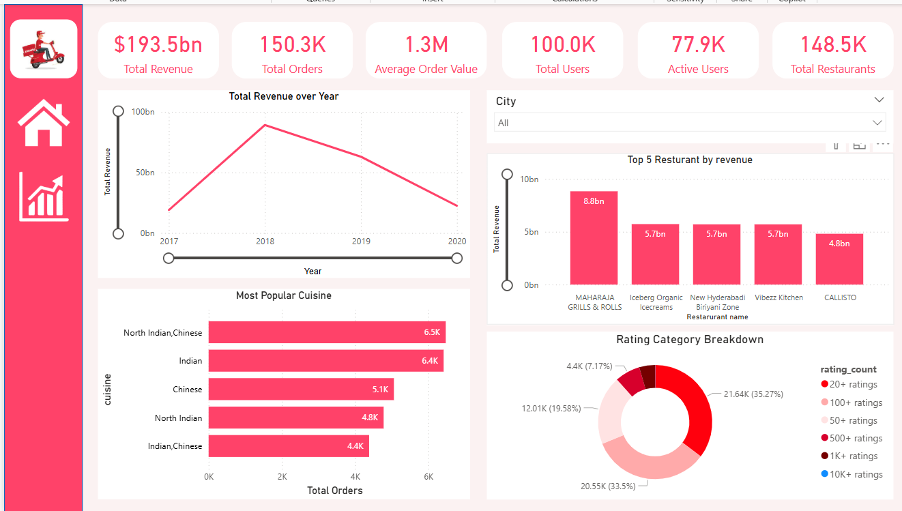
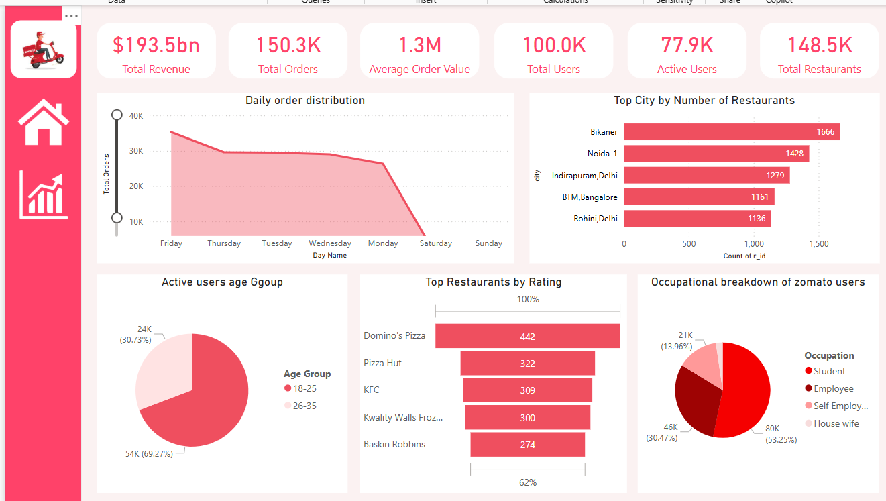

🍽️ Power BI Zomato Dashboard

📌 Overview
This project presents a comprehensive Power BI dashboard that analyzes Zomato-style food delivery data. The dashboard helps stakeholders explore customer behavior, restaurant performance, order trends, and menu analytics.

It's built for business analysts, data enthusiasts, and restaurant managers to drive data-informed decisions.

📁 Datasets Used
The following datasets were used in this project (from food.xlsx):

Users: Customer details including location and demographics

Restaurants: Information about restaurant names, locations, ratings, and cuisines

Menu: Menu items with pricing and categories

Orders: Order transactions including quantity, value, and time

Food: Master food categories and metadata

📸 Dashboard Preview
Main DashboardOrders OverviewRestaurant Insights

🔎 Save your Power BI dashboard visuals as PNG images and place them in an images/ folder in your repo.

📊 Key Features

📍 Geographic Distribution of users and restaurants

🍴 Popular Dishes and best-selling menu items

📈 Order Trends by time, value, and frequency

⭐️ Top-rated Restaurants based on user reviews

💵 Revenue Analysis from orders and pricing

🔧 How to Use

Clone the repo:
bashCopyEditgit clone https://github.com/NencyLaheri/ZOMATO-Insights-Dashboard.git

Open zomato_dashboard.pbix in Power BI Desktop.

Make sure food.xlsx is available in the project root directory.

Refresh the data and explore the visuals interactively.

🧰 Tools Used

Power BI Desktop

Excel (for dataset)

DAX and Power Query for data modeling and transformation

🖼️ How to Add Images in Markdown
markdownCopyEdit
markdownCopyEdit

Put all visuals in the /images folder and use relative links in your README.

📄 License
Licensed under the MIT License.

🙏 Acknowledgements

Sample Zomato data (synthetic or anonymized)

Power BI documentation and support community